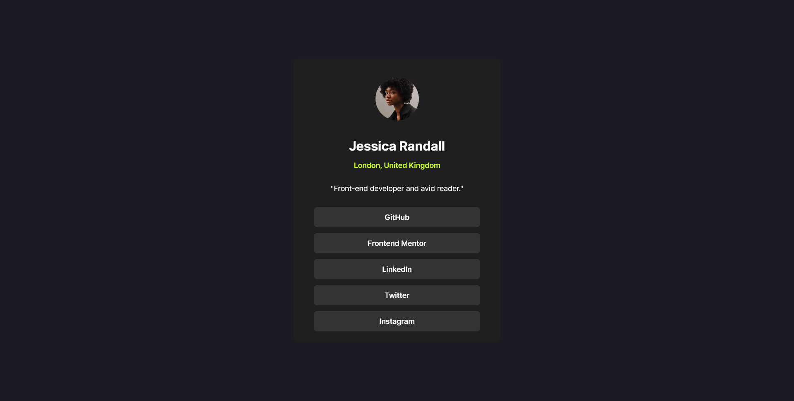

# Frontend Mentor - Social links profile solution

This is a solution to the [Social links profile challenge on Frontend Mentor](https://www.frontendmentor.io/challenges/social-links-profile-UG32l9m6dQ). Frontend Mentor challenges help you improve your coding skills by building realistic projects. 

## Table of contents

- [Overview](#overview)
  - [The challenge](#the-challenge)
  - [Screenshot](#screenshot)
  - [Links](#links)
- [My process](#my-process)
  - [Built with](#built-with)
  - [What I learned](#what-i-learned)
- [Author](#author)

## Overview

### The challenge

Users should be able to:

- See hover and focus states for all interactive elements on the page

### Screenshot



### Links

- Solution URL: [Social links profile solution](https://github.com/phangtono/social-links-profile)
- Live Site URL: [Social links profile Live Site](https://soft-lily-a42e82.netlify.app/)

## My process

### Built with

- HTML5
- CSS
- Flexbox
- Grid

### What I learned
I use display:grid, place-content: center; to get the content positioned in the middle of the screen.
```css
body{
  margin: 0;
  height: 100vh;
  display: grid;
  place-content: center;
}
```
For lists arranged in rows, I use display: flex; flex-direction: column;
```css
.profile-links{
    display: flex;
    flex-direction: column;
    align-items: center;
    gap: .8rem;
    margin-block-end: 1.5rem;
}
```
## Author

- Frontend Mentor - [@phangtono](https://www.frontendmentor.io/profile/phangtono)